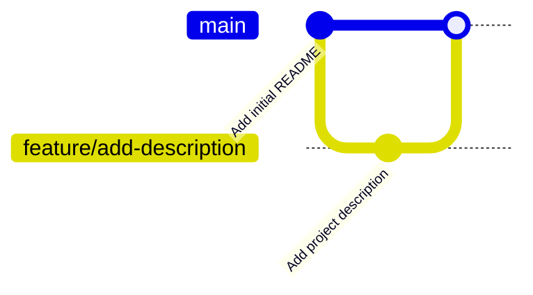

# Intern Onramp Roadmaps: Web Tech & Unix Terminal

Audience: Sol, Harper, Toby, Ben  
Expected Level: Smart beginners, no prior programming required  
Pace: Self‑guided, evenings/weekends, with weekly pair‑programming check‑ins

---

## How to Use This Document

This document is written so you can:
- Read it **alone** without a teacher present
- Try things immediately on your own computer
- Re‑read sections as many times as needed

If something doesn’t click at first, that’s normal. Understanding comes from *doing*, not memorizing.

Whenever you see:
- **▶ Try This** — you should actually do it
- **⚠ Common Mistake** — slow down and read carefully

---

# Roadmap A — Web Technology Fundamentals

## Phase 0 — Mental Models: How the Web Actually Works

### What Is the Web?

At its core, the web is a **conversation between computers**.

One computer asks for something. Another computer responds.

That’s it.

Everything else — websites, apps, videos, social media — is built on top of that simple idea.

---

### Clients and Servers

- A **client** is a device or program that *requests* data
  - Examples: your browser, a phone app, a SwiftUI app
- A **server** is a computer that *responds* to requests
  - Servers are usually always on and connected to the internet

Clients:
- initiate communication
- ask questions

Servers:
- wait for requests
- return answers

---

### What Happens When You Type a URL?

Example:
```
https://example.com
```

Step by step:
1. Your browser asks the internet: “Where is example.com?” (DNS)
2. It opens a secure connection to that server (HTTPS)
3. It sends an **HTTP request** saying:
   > “Please send me the homepage”
4. The server responds with:
   - HTML
   - images
   - other resources
5. Your browser reads the HTML and builds the page

---

### ▶ Try This: Inspect a Real Website

1. Open any website
2. Right‑click → Inspect
3. Click the **Network** tab
4. Refresh the page

You will see:
- HTML documents
- images
- API requests

Every modern app does this.

---

### Why Native Apps Still Use Web Tech

Even though TellUrStori is written in SwiftUI:
- it still sends HTTP requests
- it still receives JSON
- it still talks to servers

If you understand the web, you understand how *apps talk to the world*.

---

## Phase 1 — HTML & the DOM

### What HTML Actually Is

HTML stands for **HyperText Markup Language**.

HTML:
- does NOT control logic
- does NOT control styling
- DOES describe **structure and meaning**

Think of HTML as the *skeleton* of a page.

### Elements

Below is a comprehensive list of all HTML elements.

- [`<a>`](https://developer.mozilla.org/en-US/docs/Web/HTML/Element/a) - The Anchor element
- [`<abbr>`](https://developer.mozilla.org/en-US/docs/Web/HTML/Element/abbr) - The Abbreviation element
- [`<address>`](https://developer.mozilla.org/en-US/docs/Web/HTML/Element/address) - The Contact Address element
- [`<area>`](https://developer.mozilla.org/en-US/docs/Web/HTML/Element/area) - The Image Map Area element
- [`<article>`](https://developer.mozilla.org/en-US/docs/Web/HTML/Element/article) - The Article element
- [`<aside>`](https://developer.mozilla.org/en-US/docs/Web/HTML/Element/aside) - The Aside element
- [`<audio>`](https://developer.mozilla.org/en-US/docs/Web/HTML/Element/audio) - The Audio element
- [`<b>`](https://developer.mozilla.org/en-US/docs/Web/HTML/Element/b) - The Bring Attention To element
- [`<base>`](https://developer.mozilla.org/en-US/docs/Web/HTML/Element/base) - The Base URL element
- [`<bdi>`](https://developer.mozilla.org/en-US/docs/Web/HTML/Element/bdi) - The Bidirectional Isolation element
- [`<bdo>`](https://developer.mozilla.org/en-US/docs/Web/HTML/Element/bdo) - The Bidirectional Text Override element
- [`<blockquote>`](https://developer.mozilla.org/en-US/docs/Web/HTML/Element/blockquote) - The Block Quotation element
- [`<body>`](https://developer.mozilla.org/en-US/docs/Web/HTML/Element/body) - The Document Body element
- [`<br>`](https://developer.mozilla.org/en-US/docs/Web/HTML/Element/br) - The Line Break element
- [`<button>`](https://developer.mozilla.org/en-US/docs/Web/HTML/Element/button) - The Button element
- [`<canvas>`](https://developer.mozilla.org/en-US/docs/Web/HTML/Element/canvas) - The Canvas element
- [`<caption>`](https://developer.mozilla.org/en-US/docs/Web/HTML/Element/caption) - The Table Caption element
- [`<cite>`](https://developer.mozilla.org/en-US/docs/Web/HTML/Element/cite) - The Citation element
- [`<code>`](https://developer.mozilla.org/en-US/docs/Web/HTML/Element/code) - The Inline Code element
- [`<col>`](https://developer.mozilla.org/en-US/docs/Web/HTML/Element/col) - The Table Column element
- [`<colgroup>`](https://developer.mozilla.org/en-US/docs/Web/HTML/Element/colgroup) - The Table Column Group element
- [`<data>`](https://developer.mozilla.org/en-US/docs/Web/HTML/Element/data) - The Data element
- [`<datalist>`](https://developer.mozilla.org/en-US/docs/Web/HTML/Element/datalist) - The Datalist element
- [`<dd>`](https://developer.mozilla.org/en-US/docs/Web/HTML/Element/dd) - The Description Details element
- [`<del>`](https://developer.mozilla.org/en-US/docs/Web/HTML/Element/del) - The Deleted Text element
- [`<details>`](https://developer.mozilla.org/en-US/docs/Web/HTML/Element/details) - The Details Disclosure element
- [`<dfn>`](https://developer.mozilla.org/en-US/docs/Web/HTML/Element/dfn) - The Definition element
- [`<dialog>`](https://developer.mozilla.org/en-US/docs/Web/HTML/Element/dialog) - The Dialog element
- [`<div>`](https://developer.mozilla.org/en-US/docs/Web/HTML/Element/div) - The Content Division element
- [`<dl>`](https://developer.mozilla.org/en-US/docs/Web/HTML/Element/dl) - The Description List element
- [`<dt>`](https://developer.mozilla.org/en-US/docs/Web/HTML/Element/dt) - The Description Term element
- [`<em>`](https://developer.mozilla.org/en-US/docs/Web/HTML/Element/em) - The Emphasis element
- [`<embed>`](https://developer.mozilla.org/en-US/docs/Web/HTML/Element/embed) - The Embedded Content element
- [`<fieldset>`](https://developer.mozilla.org/en-US/docs/Web/HTML/Element/fieldset) - The Field Set element
- [`<figcaption>`](https://developer.mozilla.org/en-US/docs/Web/HTML/Element/figcaption) - The Figure Caption element
- [`<figure>`](https://developer.mozilla.org/en-US/docs/Web/HTML/Element/figure) - The Figure element
- [`<footer>`](https://developer.mozilla.org/en-US/docs/Web/HTML/Element/footer) - The Footer element
- [`<form>`](https://developer.mozilla.org/en-US/docs/Web/HTML/Element/form) - The Form element
- [`<h1>`](https://developer.mozilla.org/en-US/docs/Web/HTML/Element/Heading_Elements) - The Heading Level 1 element
- [`<h2>`](https://developer.mozilla.org/en-US/docs/Web/HTML/Element/Heading_Elements) - The Heading Level 2 element
- [`<h3>`](https://developer.mozilla.org/en-US/docs/Web/HTML/Element/Heading_Elements) - The Heading Level 3 element
- [`<h4>`](https://developer.mozilla.org/en-US/docs/Web/HTML/Element/Heading_Elements) - The Heading Level 4 element
- [`<h5>`](https://developer.mozilla.org/en-US/docs/Web/HTML/Element/Heading_Elements) - The Heading Level 5 element
- [`<h6>`](https://developer.mozilla.org/en-US/docs/Web/HTML/Element/Heading_Elements) - The Heading Level 6 element
- [`<head>`](https://developer.mozilla.org/en-US/docs/Web/HTML/Element/head) - The Document Head element
- [`<header>`](https://developer.mozilla.org/en-US/docs/Web/HTML/Element/header) - The Header element
- [`<hgroup>`](https://developer.mozilla.org/en-US/docs/Web/HTML/Element/hgroup) - The Heading Group element
- [`<hr>`](https://developer.mozilla.org/en-US/docs/Web/HTML/Element/hr) - The Thematic Break element
- [`<html>`](https://developer.mozilla.org/en-US/docs/Web/HTML/Element/html) - The HTML Document / Root element
- [`<i>`](https://developer.mozilla.org/en-US/docs/Web/HTML/Element/i) - The Idiomatic Text element
- [`<iframe>`](https://developer.mozilla.org/en-US/docs/Web/HTML/Element/iframe) - The Inline Frame element
- [``](https://developer.mozilla.org/en-US/docs/Web/HTML/Element/img) - The Image element
- [`<input>`](https://developer.mozilla.org/en-US/docs/Web/HTML/Element/input) - The Input element
- [`<ins>`](https://developer.mozilla.org/en-US/docs/Web/HTML/Element/ins) - The Inserted Text element
- [`<kbd>`](https://developer.mozilla.org/en-US/docs/Web/HTML/Element/kbd) - The Keyboard Input element
- [`<label>`](https://developer.mozilla.org/en-US/docs/Web/HTML/Element/label) - The Label element
- [`<legend>`](https://developer.mozilla.org/en-US/docs/Web/HTML/Element/legend) - The Field Set Legend element
- [`<li>`](https://developer.mozilla.org/en-US/docs/Web/HTML/Element/li) - The List Item element
- [`<link>`](https://developer.mozilla.org/en-US/docs/Web/HTML/Element/link) - The External Resource Link element
- [`<main>`](https://developer.mozilla.org/en-US/docs/Web/HTML/Element/main) - The Main Content element
- [`<map>`](https://developer.mozilla.org/en-US/docs/Web/HTML/Element/map) - The Image Map element
- [`<mark>`](https://developer.mozilla.org/en-US/docs/Web/HTML/Element/mark) - The Mark Text element
- [`<menu>`](https://developer.mozilla.org/en-US/docs/Web/HTML/Element/menu) - The Menu element
- [`<meta>`](https://developer.mozilla.org/en-US/docs/Web/HTML/Element/meta) - The Metadata element
- [`<meter>`](https://developer.mozilla.org/en-US/docs/Web/HTML/Element/meter) - The Meter element
- [`<nav>`](https://developer.mozilla.org/en-US/docs/Web/HTML/Element/nav) - The Navigation element
- [`<noscript>`](https://developer.mozilla.org/en-US/docs/Web/HTML/Element/noscript) - The No Script element
- [`<object>`](https://developer.mozilla.org/en-US/docs/Web/HTML/Element/object) - The External Object element
- [`<ol>`](https://developer.mozilla.org/en-US/docs/Web/HTML/Element/ol) - The Ordered List element
- [`<optgroup>`](https://developer.mozilla.org/en-US/docs/Web/HTML/Element/optgroup) - The Option Group element
- [`<option>`](https://developer.mozilla.org/en-US/docs/Web/HTML/Element/option) - The Option element
- [`<output>`](https://developer.mozilla.org/en-US/docs/Web/HTML/Element/output) - The Output element
- [`<p>`](https://developer.mozilla.org/en-US/docs/Web/HTML/Element/p) - The Paragraph element
- [`<picture>`](https://developer.mozilla.org/en-US/docs/Web/HTML/Element/picture) - The Picture element
- [`<pre>`](https://developer.mozilla.org/en-US/docs/Web/HTML/Element/pre) - The Preformatted Text element
- [`<progress>`](https://developer.mozilla.org/en-US/docs/Web/HTML/Element/progress) - The Progress Indicator element
- [`<q>`](https://developer.mozilla.org/en-US/docs/Web/HTML/Element/q) - The Inline Quotation element
- [`<rp>`](https://developer.mozilla.org/en-US/docs/Web/HTML/Element/rp) - The Ruby Fallback Parenthesis element
- [`<rt>`](https://developer.mozilla.org/en-US/docs/Web/HTML/Element/rt) - The Ruby Text element
- [`<ruby>`](https://developer.mozilla.org/en-US/docs/Web/HTML/Element/ruby) - The Ruby Annotation element
- [`<s>`](https://developer.mozilla.org/en-US/docs/Web/HTML/Element/s) - The Strikethrough element
- [`<samp>`](https://developer.mozilla.org/en-US/docs/Web/HTML/Element/samp) - The Sample Output element
- [`<script>`](https://developer.mozilla.org/en-US/docs/Web/HTML/Element/script) - The Script element
- [`<section>`](https://developer.mozilla.org/en-US/docs/Web/HTML/Element/section) - The Generic Section element
- [`<select>`](https://developer.mozilla.org/en-US/docs/Web/HTML/Element/select) - The Select element
- [`<slot>`](https://developer.mozilla.org/en-US/docs/Web/HTML/Element/slot) - The Web Component Slot element
- [`<small>`](https://developer.mozilla.org/en-US/docs/Web/HTML/Element/small) - The Side Comment element
- [`<source>`](https://developer.mozilla.org/en-US/docs/Web/HTML/Element/source) - The Media or Image Source element
- [`<span>`](https://developer.mozilla.org/en-US/docs/Web/HTML/Element/span) - The Content Span element
- [`<strong>`](https://developer.mozilla.org/en-US/docs/Web/HTML/Element/strong) - The Strong Importance element
- [`<style>`](https://developer.mozilla.org/en-US/docs/Web/HTML/Element/style) - The Style Information element
- [`<sub>`](https://developer.mozilla.org/en-US/docs/Web/HTML/Element/sub) - The Subscript element
- [`<summary>`](https://developer.mozilla.org/en-US/docs/Web/HTML/Element/summary) - The Disclosure Summary element
- [`<sup>`](https://developer.mozilla.org/en-US/docs/Web/HTML/Element/sup) - The Superscript element
- [`<table>`](https://developer.mozilla.org/en-US/docs/Web/HTML/Element/table) - The Table element
- [`<tbody>`](https://developer.mozilla.org/en-US/docs/Web/HTML/Element/tbody) - The Table Body element
- [`<td>`](https://developer.mozilla.org/en-US/docs/Web/HTML/Element/td) - The Table Data Cell element
- [`<template>`](https://developer.mozilla.org/en-US/docs/Web/HTML/Element/template) - The Content Template element
- [`<textarea>`](https://developer.mozilla.org/en-US/docs/Web/HTML/Element/textarea) - The Textarea element
- [`<tfoot>`](https://developer.mozilla.org/en-US/docs/Web/HTML/Element/tfoot) - The Table Foot element
- [`<th>`](https://developer.mozilla.org/en-US/docs/Web/HTML/Element/th) - The Table Header element
- [`<thead>`](https://developer.mozilla.org/en-US/docs/Web/HTML/Element/thead) - The Table Head element
- [`<time>`](https://developer.mozilla.org/en-US/docs/Web/HTML/Element/time) - The Time element
- [`<title>`](https://developer.mozilla.org/en-US/docs/Web/HTML/Element/title) - The Document Title element
- [`<tr>`](https://developer.mozilla.org/en-US/docs/Web/HTML/Element/tr) - The Table Row element
- [`<track>`](https://developer.mozilla.org/en-US/docs/Web/HTML/Element/track) - The Text Track element
- [`<u>`](https://developer.mozilla.org/en-US/docs/Web/HTML/Element/u) - The Unarticulated Annotation element
- [`<ul>`](https://developer.mozilla.org/en-US/docs/Web/HTML/Element/ul) - The Unordered List element
- [`<var>`](https://developer.mozilla.org/en-US/docs/Web/HTML/Element/var) - The Variable element
- [`<video>`](https://developer.mozilla.org/en-US/docs/Web/HTML/Element/video) - The Video element
- [`<wbr>`](https://developer.mozilla.org/en-US/docs/Web/HTML/Element/wbr) - The Line Break Opportunity element

---

### Basic HTML Example

```html
<!DOCTYPE html>
<html>
  <head>
    <title>My Page</title>
  </head>
  <body>
    <h1>Hello World</h1>
    <p>This is a paragraph.</p>
  </body>
</html>
```

**How tags work:**
- **Opening tags** use angle brackets: `<tagname>`
- **Closing tags** add a forward slash before the tag name: `</tagname>`
- Content goes **between** the opening and closing tags
- Example: `<p>This is a paragraph.</p>` — the `<p>` opens, the text is the content, and `</p>` closes
- Some tags are **self-closing** (like [`<br>`](https://developer.mozilla.org/en-US/docs/Web/HTML/Element/br) or [``](https://developer.mozilla.org/en-US/docs/Web/HTML/Element/img)) and don't need a separate closing tag
  - [`<area>`](https://developer.mozilla.org/en-US/docs/Web/HTML/Element/area) - Image map area
  - [`<base>`](https://developer.mozilla.org/en-US/docs/Web/HTML/Element/base) - Base URL
  - [`<br>`](https://developer.mozilla.org/en-US/docs/Web/HTML/Element/br) - Line break
  - [`<col>`](https://developer.mozilla.org/en-US/docs/Web/HTML/Element/col) - Table column
  - [`<embed>`](https://developer.mozilla.org/en-US/docs/Web/HTML/Element/embed) - Embedded content
  - [`<hr>`](https://developer.mozilla.org/en-US/docs/Web/HTML/Element/hr) - Thematic break (horizontal rule)
  - [``](https://developer.mozilla.org/en-US/docs/Web/HTML/Element/img) - Image
  - [`<input>`](https://developer.mozilla.org/en-US/docs/Web/HTML/Element/input) - Form input
  - [`<link>`](https://developer.mozilla.org/en-US/docs/Web/HTML/Element/link) - External resource link
  - [`<meta>`](https://developer.mozilla.org/en-US/docs/Web/HTML/Element/meta) - Metadata
  - [`<source>`](https://developer.mozilla.org/en-US/docs/Web/HTML/Element/source) - Media source
  - [`<track>`](https://developer.mozilla.org/en-US/docs/Web/HTML/Element/track) - Text track
  - [`<wbr>`](https://developer.mozilla.org/en-US/docs/Web/HTML/Element/wbr) - Line break opportunity

Important ideas:
- Tags open and close
- Indentation shows hierarchy

---

### Nesting and Structure

HTML forms a **tree**:

```html
<article>
  <h2>Title</h2>
  <p>Text</p>
</article>
```

`article` is the parent  
`h2` and `p` are children

⚠ **Closing tags incorrectly breaks the tree.**

What does this mean? You must close tags in the **correct order** — the last tag you open should be the first one you close. Think of it like stacking boxes: you close the top box before the bottom one.

**Correct:**
```html
<article>
  <h2>Title</h2>
  <p>Text</p>
</article>
```

**Wrong (closing in wrong order):**
```html
<article>
  <h2>Title</article>  <!-- ❌ Can't close article before closing h2 -->
  </h2>
  <p>Text</p>
```

**Wrong (forgetting to close a tag):**
```html
<article>
  <h2>Title</h2>  <!-- ❌ Missing closing </p> tag -->
  <p>Text
</article>
```

When tags are closed incorrectly, browsers try to fix it, but the page structure becomes unpredictable and may not display as intended.

**Note:** When tags are closed correctly, your markup is considered **well-formed**. This is different from **semantic HTML** (covered next), which is about choosing the right elements for their meaning.

---

### Semantic HTML

Semantic tags describe *meaning*:
- `<header>`
- `<nav>`
- `<main>`
- `<article>`
- `<footer>`

Why this matters:
- Accessibility
- Search engines
- Maintainability

---

### A Personal Note: Contributing to the HTML Specification

The HTML elements listed above didn't just appear out of nowhere — they were designed, debated, and refined by real people working together.

During college, I (Carlos Gabriel Cardona) had the incredible opportunity to be a member of the W3C's HTML5 Working Group, sponsored by Google. For a year, I attended weekly calls, met with the team in San Jose and Silicon Valley, and contributed mockups that made it into the actual HTML specification.

You can see my name listed among the acknowledged contributors in the official HTML specification:


This is a reminder that web standards are built by people — and your contributions matter too.

---

### ▶ Try This: Create Your First Homepage

Create a simple HTML homepage that includes:

**Required elements:**
- `<main>` - Wrap your main content
- `<p>` - Add paragraphs describing yourself
- `<header>` - Include a header section
- `<footer>` - Add a footer
- `<ul>` - Create an unordered list (e.g., for hobbies)
- `<ol>` - Create an ordered list (e.g., for favorite things)
- `<a>` - Add at least one link

**Content to include:**
- Your name
- Your age
- Your location
- Your hobbies
- A picture of yourself

**Bonus points for using:**
- `<audio>` - Embed an audio file
- `<video>` - Embed a video file

After you've created your homepage, validate it using the [HTML Validator](https://validator.w3.org/) to make sure it's well-formed!

**Example:** Here's a [complete example homepage](index.html) that demonstrates all the required elements. When you validate it, you should see a result like this:


This shows what success looks like — all green checkmarks mean your HTML is well-formed and follows web standards!

---

### Validating Your HTML and CSS

Before moving on, it's important to ensure your markup and styles are well-formed and semantic. The W3C provides free validators to check your code:

- [CSS Validator](https://jigsaw.w3.org/css-validator/) - Validates your CSS
- [HTML Validator](https://validator.w3.org/) - Validates your HTML markup

These tools help catch errors and ensure your code follows web standards.

---

### The DOM (Document Object Model)

When the browser loads HTML:
- it converts it into a **live object tree** called the DOM
- every element becomes a node


The DOM is what:
- JavaScript manipulates
- automation tools inspect
- UI systems mirror

Understanding the DOM = understanding UI frameworks.

---

### Manipulating the DOM with JavaScript

JavaScript can interact with the DOM to:
- **Read** elements and their content
- **Modify** elements (change text, attributes, styles)
- **Create** new elements
- **Remove** elements

**Basic DOM manipulation:**

```javascript
// Find an element by its ID
const header = document.getElementById('myHeader');

// Find elements by tag name
const paragraphs = document.getElementsByTagName('p');

// Find elements by class name
const items = document.getElementsByClassName('item');

// Modern approach: querySelector (more flexible)
const firstParagraph = document.querySelector('p');
const allLinks = document.querySelectorAll('a');
```

**Modifying elements:**

```javascript
// Change text content
const heading = document.querySelector('h1');
heading.textContent = 'New Title';

// Change HTML content
heading.innerHTML = '<em>Emphasized Title</em>';

// Change attributes
const image = document.querySelector('img');
image.src = 'new-image.jpg';
image.alt = 'New description';

// Change styles
heading.style.color = 'blue';
heading.style.fontSize = '24px';
```

**Creating and adding elements:**

```javascript
// Create a new element
const newParagraph = document.createElement('p');
newParagraph.textContent = 'This is a new paragraph';

// Add it to the page
const main = document.querySelector('main');
main.appendChild(newParagraph);
```

**Removing elements:**

```javascript
// Remove an element
const oldElement = document.querySelector('.old');
oldElement.remove();
```

This is the foundation of interactive web pages — JavaScript reads and modifies the DOM to respond to user actions.

---

### How jQuery Simplified DOM Manipulation

The native DOM API can be verbose and inconsistent. In 2006, **John Resig** created **jQuery**, a library that abstracted away these inconveniences and made DOM manipulation more accessible and intuitive.

**The Problem with Native JavaScript:**

```javascript
// Finding elements - different methods for different selectors
const byId = document.getElementById('myId');
const byClass = document.getElementsByClassName('myClass');  // Returns array-like
const byTag = document.getElementsByTagName('p');            // Returns array-like
const bySelector = document.querySelector('.myClass');      // Returns single element
const bySelectorAll = document.querySelectorAll('.myClass'); // Returns NodeList

// Modifying - need to check if element exists
if (byId) {
  byId.textContent = 'New text';
}

// Working with multiple elements - need loops
for (let i = 0; i < byClass.length; i++) {
  byClass[i].style.color = 'red';
}
```

**jQuery's Solution:**

jQuery provides a **consistent, chainable API** that works the same way regardless of how many elements you're working with:

```javascript
// Finding elements - one method for everything
$('#myId');                    // By ID
$('.myClass');                 // By class (works on all matches)
$('p');                        // By tag (works on all matches)
$('.myClass, #myId, p');       // Multiple selectors

// Modifying - automatically handles existence
$('#myId').text('New text');

// Working with multiple elements - automatically applies to all
$('.myClass').css('color', 'red');
```

**Key Improvements:**

1. **Consistent API** — `$()` works for any selector, always returns a jQuery object
2. **Method chaining** — operations can be chained together:
   ```javascript
   $('.item')
     .addClass('active')
     .css('color', 'blue')
     .fadeIn();
   ```
3. **Cross-browser compatibility** — jQuery handles browser differences automatically
4. **Simplified syntax** — less code, more readable:
   ```javascript
   // Vanilla JavaScript
   document.querySelector('.button').addEventListener('click', function() {
     document.querySelector('.content').style.display = 'block';
   });
   
   // jQuery
   $('.button').click(function() {
     $('.content').show();
   });
   ```

**The Lesson:**

jQuery demonstrated that **good abstractions make complex APIs accessible**. By wrapping the verbose DOM API in a simpler interface, John Resig made web development more approachable for millions of developers. Modern frameworks (React, Vue, Angular) continue this tradition — they abstract away complexity to make building UIs easier.

---

### document.querySelector: jQuery's Influence on Native JavaScript

Interestingly, jQuery's success directly influenced the web standards themselves. The native `document.querySelector` method (introduced in 2008) was **inspired by jQuery's CSS selector approach**. This is a perfect example of how a library can prove a concept valuable enough that it becomes a standard.

**Why querySelector is Superior:**

**1. One Method for All Selectors**

**Old way** — different methods for different selectors:
```javascript
// Need to remember different methods
const byId = document.getElementById('myId');
const byClass = document.getElementsByClassName('myClass');
const byTag = document.getElementsByTagName('p');
```

**With querySelector** — one method for everything:
```javascript
// Same method, just different selectors
const byId = document.querySelector('#myId');
const byClass = document.querySelector('.myClass');
const byTag = document.querySelector('p');
```

**2. Full CSS Selector Support**

You can use any CSS selector, including complex ones that weren't possible with the old methods:

```javascript
// Complex selectors that weren't possible before
document.querySelector('div.container > p:first-child');
document.querySelector('input[type="email"]');
document.querySelector('.item:nth-child(3)');
document.querySelector('header + main');
document.querySelector('a[href^="https"]'); // Links starting with https
```

**3. Consistent Return Value**

**Old way** — inconsistent return types:
```javascript
getElementById('id')           // Returns Element or null
getElementsByClassName('class') // Returns HTMLCollection (array-like)
getElementsByTagName('p')       // Returns HTMLCollection (array-like)
```

**With querySelector** — always returns a single Element or null:
```javascript
querySelector('#id')    // Returns Element or null
querySelector('.class') // Returns Element or null (first match)
querySelector('p')      // Returns Element or null (first match)
```

This makes code more predictable — you always get one element or null.

**4. More Flexible Selection**

```javascript
// Find the first element matching any selector
document.querySelector('div, p, .class, #id');

// Find nested elements in one call
document.querySelector('article header h1');

// Use pseudo-selectors
document.querySelector('li:last-child');
document.querySelector('input:checked');
```

**5. Simpler Mental Model**

Instead of remembering:
- `getElementById` for IDs
- `getElementsByClassName` for classes
- `getElementsByTagName` for tags
- Manual filtering for complex cases

You just remember: `querySelector` + CSS selector.

**The Pattern:**

This demonstrates a common pattern in web development:
1. **Library proves a concept** (jQuery with CSS selectors)
2. **Community adopts it widely**
3. **Standards bodies standardize it**
4. **Browsers implement it natively**

Other examples include:
- `fetch()` API (inspired by libraries like Axios)
- `Promise` (inspired by libraries like Q and Bluebird)
- `Array.map()`, `Array.filter()` (inspired by functional programming libraries)

**The Irony:**

jQuery's success led to native APIs that reduced the need for jQuery. Modern JavaScript includes many features that jQuery pioneered, which is why jQuery usage has declined. But we should recognize that jQuery paved the way for these improvements.

---

### ▶ Try This: Live DOM Editing

1. Inspect a webpage.
2. Find an `<h1>` or a `<p>`.
3. Double‑click the text.
4. Change it.

You just modified the DOM in real time.

---

### ▶ Try This: Manipulate the DOM with JavaScript

Let's practice DOM manipulation using the example homepage in this repository. The DOM visualization you saw earlier represents the structure of `index.html` — now you'll manipulate it with JavaScript!

**Steps:**

1. Open `index.html` in your browser (double-click the file or drag it into a browser window) or in Terminal run `open index.html`.
2. Open the Developer Console:
   - **Chrome/Edge**: `Cmd+Option+I` (Mac) / `Ctrl+Shift+I` (Windows)
   - **Firefox**: `Cmd+Option+K` (Mac) / `Ctrl+Shift+K` (Windows)
   - **Safari**: Enable Developer menu first, then `Cmd+Option+C`
3. Paste these commands one at a time and watch what happens:

**Finding Elements:**

```javascript
// Find the header
document.querySelector('header');

// Find the main heading
document.querySelector('h1');

// Find all paragraphs
document.querySelectorAll('p');

// Find the image
document.querySelector('img');

// Find the link
document.querySelector('a');
```

**Modifying Content:**

```javascript
// Change the heading text
document.querySelector('h1').textContent = 'Hello from JavaScript!';

// Change a paragraph
document.querySelector('main p').textContent = 'I just changed this with JavaScript!';

// Change the image alt text
document.querySelector('img').alt = 'Updated description';

// Change the link text
document.querySelector('a').textContent = 'Visit TellUrStori';
```

**Modifying Styles:**

```javascript
// Change the heading color
document.querySelector('h1').style.color = 'blue';

// Change the heading font size
document.querySelector('h1').style.fontSize = '48px';

// Add a border to the image
document.querySelector('img').style.border = '5px solid red';

// Change background color of the main element
document.querySelector('main').style.backgroundColor = '#f0f0f0';
```

**Complex Selectors:**

```javascript
// Find the first list item in the unordered list
document.querySelector('ul li');

// Find the link inside a list item
document.querySelector('ul li a');

// Find the video element by ID
document.querySelector('#video1');

// Find the audio element
document.querySelector('audio');
```

**Creating and Adding Elements:**

```javascript
// Create a new paragraph
const newP = document.createElement('p');
newP.textContent = 'This paragraph was created with JavaScript!';

// Add it to the main element
document.querySelector('main').appendChild(newP);

// Create a new list item
const newLi = document.createElement('li');
newLi.textContent = 'A new hobby: Learning web development!';
document.querySelector('ul').appendChild(newLi);
```

**Removing Elements:**

```javascript
// Remove the last list item from the ordered list
const ol = document.querySelector('ol');
const lastItem = ol.lastElementChild;
lastItem.remove();
```

**Experiment:**

Try combining operations:
```javascript
// Find and modify multiple things
document.querySelector('h1').textContent = 'My Awesome Page';
document.querySelector('h1').style.color = 'purple';
document.querySelector('h1').style.textAlign = 'center';
```

Notice how the page updates **instantly** — you're modifying the live DOM tree that the browser uses to render the page!

---

## Phase 2 — HTTP & APIs

### What Is HTTP?

HTTP = **HyperText Transfer Protocol**

It defines:
- how requests are sent
- how responses are formatted

HTTP is:
- stateless
- predictable
- universal

---

### HTTP Methods (Verbs)

| Method | Meaning |
|------|--------|
| [`GET`](https://developer.mozilla.org/en-US/docs/Web/HTTP/Reference/Methods/GET) | Requests a representation of the specified resource. Should only retrieve data and should not contain a request body. |
| [`HEAD`](https://developer.mozilla.org/en-US/docs/Web/HTTP/Reference/Methods/HEAD) | Asks for a response identical to a GET request, but without a response body. |
| [`POST`](https://developer.mozilla.org/en-US/docs/Web/HTTP/Reference/Methods/POST) | Submits an entity to the specified resource, often causing a change in state or side effects on the server. |
| [`PUT`](https://developer.mozilla.org/en-US/docs/Web/HTTP/Reference/Methods/PUT) | Replaces all current representations of the target resource with the request content. |
| [`PATCH`](https://developer.mozilla.org/en-US/docs/Web/HTTP/Reference/Methods/PATCH) | Applies partial modifications to a resource. |
| [`DELETE`](https://developer.mozilla.org/en-US/docs/Web/HTTP/Reference/Methods/DELETE) | Deletes the specified resource. |
| [`CONNECT`](https://developer.mozilla.org/en-US/docs/Web/HTTP/Reference/Methods/CONNECT) | Establishes a tunnel to the server identified by the target resource. |
| [`OPTIONS`](https://developer.mozilla.org/en-US/docs/Web/HTTP/Reference/Methods/OPTIONS) | Describes the communication options for the target resource. |
| [`TRACE`](https://developer.mozilla.org/en-US/docs/Web/HTTP/Reference/Methods/TRACE) | Performs a message loop-back test along the path to the target resource. |

**HTTP Verbs and CRUD Operations:**

These HTTP methods map directly to database **CRUD** operations (Create, Read, Update, Delete), which is why REST APIs are so common on the web:

- **POST** = **C**reate
- **GET** = **R**ead
- **PUT/PATCH** = **U**pdate
- **DELETE** = **D**elete

This mapping provides a consistent interface for interacting with data over the web. When you use a REST API, you're essentially performing database operations through HTTP requests.

---

### Status Codes

Servers respond with status codes:

| Code | Meaning |
|----|--------|
| [`200`](https://developer.mozilla.org/en-US/docs/Web/HTTP/Reference/Status/200) | OK - Success |
| [`201`](https://developer.mozilla.org/en-US/docs/Web/HTTP/Reference/Status/201) | Created - Resource successfully created (common for POST) |
| [`204`](https://developer.mozilla.org/en-US/docs/Web/HTTP/Reference/Status/204) | No Content - Success with no response body (common for DELETE) |
| [`301`](https://developer.mozilla.org/en-US/docs/Web/HTTP/Reference/Status/301) | Moved Permanently - Permanent redirect |
| [`302`](https://developer.mozilla.org/en-US/docs/Web/HTTP/Reference/Status/302) | Found - Temporary redirect |
| [`400`](https://developer.mozilla.org/en-US/docs/Web/HTTP/Reference/Status/400) | Bad Request - Invalid request syntax |
| [`401`](https://developer.mozilla.org/en-US/docs/Web/HTTP/Reference/Status/401) | Unauthorized - Authentication required |
| [`402`](https://developer.mozilla.org/en-US/docs/Web/HTTP/Reference/Status/402) | Payment Required - Reserved for future use |
| [`403`](https://developer.mozilla.org/en-US/docs/Web/HTTP/Reference/Status/403) | Forbidden - Authenticated but not authorized |
| [`404`](https://developer.mozilla.org/en-US/docs/Web/HTTP/Reference/Status/404) | Not Found - Resource doesn't exist |
| [`429`](https://developer.mozilla.org/en-US/docs/Web/HTTP/Reference/Status/429) | Too Many Requests - Rate limit exceeded |
| [`500`](https://developer.mozilla.org/en-US/docs/Web/HTTP/Reference/Status/500) | Internal Server Error - Server-side error |
| [`502`](https://developer.mozilla.org/en-US/docs/Web/HTTP/Reference/Status/502) | Bad Gateway - Invalid response from upstream server |
| [`503`](https://developer.mozilla.org/en-US/docs/Web/HTTP/Reference/Status/503) | Service Unavailable - Server temporarily unavailable |

Machines use these instead of words.

**Note on 402 Payment Required:**

The original web architects (including Tim Berners-Lee) included status code 402 "Payment Required" in the HTTP specification, anticipating that the web would need a way to handle micropayments and digital transactions. However, no standard payment system emerged at the time, so 402 was reserved for future use and never widely implemented.

This void in native web payment infrastructure is exactly what cryptocurrencies and blockchain technologies later filled — providing the decentralized payment mechanism that the early web architects envisioned. The existence of 402 serves as a reminder that the web's creators were thinking about digital payments from the very beginning.

During one of the HTML Working Group meetings, I had the honor of meeting Tim Berners-Lee, the inventor of the World Wide Web, and he was kind enough to hold Sol (grinding on a slice of pizza! 🍕😆) for a photo:


---

### JSON

JSON = **JavaScript Object Notation**

Example:
```json
{
  "id": 42,
  "name": "Sol",
  "active": true
}
```

Why JSON?
- Human readable
- Language independent
- Maps cleanly to data structures

---

### ▶ Try This: curl

```bash
curl https://api.github.com
```

You just made an HTTP `GET` request.

---

## Phase 3 — From Web to App Thinking

### APIs as Contracts

An API is a promise:
- If you send this request
- You will receive this response

Breaking that promise breaks apps.

---

### JSON → Swift Example

```swift
struct User: Codable {
  let id: Int
  let name: String
}
```

Keys must match JSON fields.

---

### ▶ Try This

Take JSON from a real API and model it in Swift.

---

# Roadmap B — Unix Terminal & Workflow

## Phase 0 — Terminal Orientation

### What Is the Terminal?

The terminal is a text interface to your computer.

It gives:
- more control
- more power
- more responsibility

---

### Filesystem Basics

Everything lives in a tree:

```
/
├── Users
│   └── you
│       └── Projects
```

---

### ▶ Try This

```bash
pwd
ls
cd ~
```

---

## Phase 1 — Core Commands

Commands:
- `pwd` — print working directory (shows where you are)
- `ls` — list files and directories
- `cd` — change directory
- `mkdir` — make directory
- `touch` — create empty file
- `cat` — display file contents
- `cp` — copy files or directories
- `mv` — move or rename files
- `rm` — remove files

⚠ `rm -rf` deletes permanently.

---

## Phase 2 — Pipes & Processes

Unix philosophy:
> Small tools combined do powerful things.

Example:
```bash
ls | grep txt
```

---

## Phase 3 — Git

**Git** is a version control system that tracks changes to your files over time. Think of it as a time machine for your code — you can see what changed, when it changed, and who changed it. Git allows you to:
- **Track history** — Every change is recorded with a commit message
- **Work collaboratively** — Multiple people can work on the same project
- **Experiment safely** — Create branches to try new features without breaking the main code
- **Revert mistakes** — Go back to any previous version if something goes wrong

### Basic Git Workflow

Here's a visual overview of the workflow we'll walk through:



Let's walk through creating a repository and making your first commits:

**1. Initialize a new repository:**
```bash
git init
```
This creates a new Git repository in your current directory. Git will start tracking changes to files in this folder.

**2. Create and edit a README file:**
```bash
touch README.md
echo "# My Project" > README.md
echo "" >> README.md
echo "This is my first project using Git." >> README.md
```

**3. Stage and commit your changes:**
```bash
git add README.md
git commit -m "Add initial README"
```
- `git add` stages files (tells Git which files you want to include in the commit)
- `git commit` creates a snapshot of your changes with a message describing what you did

**4. Create a feature branch:**
```bash
git checkout -b feature/add-description
```
This creates a new branch called `feature/add-description` and switches to it. Branches let you work on features without affecting the main code.

**5. Make changes and commit them:**
```bash
echo "" >> README.md
echo "## About" >> README.md
echo "This project demonstrates basic Git workflow." >> README.md
git add README.md
git commit -m "Add project description"
```

**6. Switch back to main and merge your changes:**
```bash
git checkout main
git merge feature/add-description
```
- `git checkout main` switches you back to the main branch
- `git merge` brings the changes from your feature branch into main

**Common commands you'll use:**
- `git status` — See what files have changed
- `git log` — View commit history
- `git diff` — See what changed in your files
- `git clone <url>` — Copy an existing repository from GitHub or another remote
- `git push` — Upload your commits to a remote repository (like GitHub)

---

## Phase 4 — AI‑Augmented Workflow

AI helps you:
- move faster
- explore ideas

AI does NOT replace understanding.

Always ask:
- Does this make sense?
- Can I explain it?

---

## Graduation Criteria

You graduate when you can:
- Explain HTTP end‑to‑end
- Read HTML confidently
- Use the terminal safely
- Collaborate using Git
- Use AI responsibly

This document is meant to be *used*, not just read.
Break things. Fix them. Learn.

