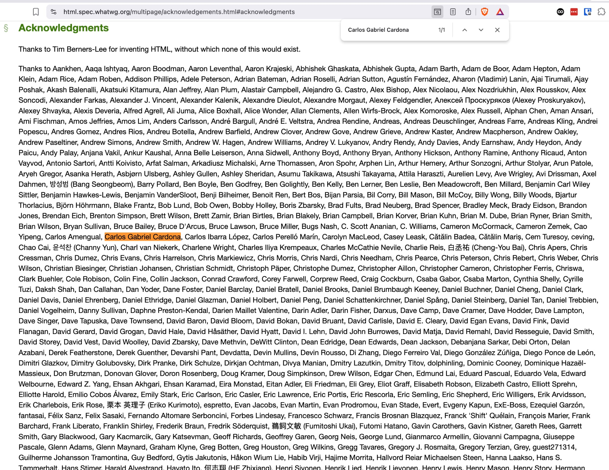
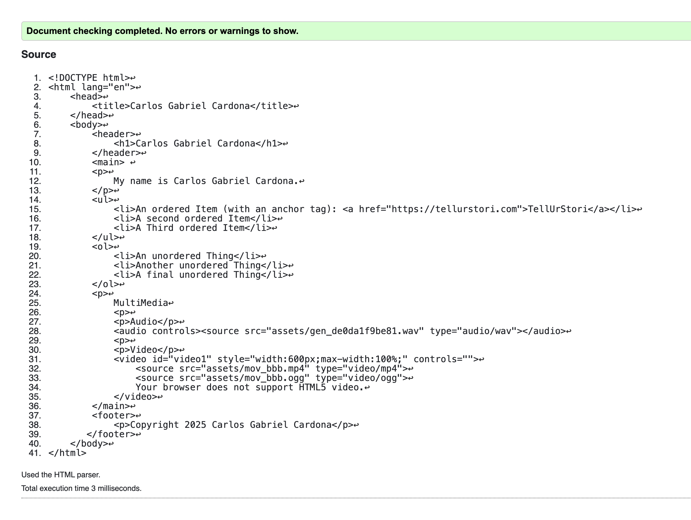
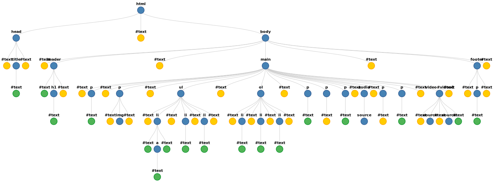

# Intern Onramp Roadmaps: Web Tech & Unix Terminal

Audience: Sol, Harper, Toby, Ben  
Expected Level: Smart beginners, no prior programming required  
Pace: Self‑guided, evenings/weekends, with weekly pair‑programming check‑ins

---

## How to Use This Document

This document is written so you can:
- Read it **alone** without a teacher present
- Try things immediately on your own computer
- Re‑read sections as many times as needed

If something doesn’t click at first, that’s normal. Understanding comes from *doing*, not memorizing.

Whenever you see:
- **▶ Try This** — you should actually do it
- **⚠ Common Mistake** — slow down and read carefully

---

# Roadmap A — Web Technology Fundamentals

## Phase 0 — Mental Models: How the Web Actually Works

### What Is the Web?

At its core, the web is a **conversation between computers**.

One computer asks for something. Another computer responds.

That’s it.

Everything else — websites, apps, videos, social media — is built on top of that simple idea.

---

### Clients and Servers

- A **client** is a device or program that *requests* data
  - Examples: your browser, a phone app, a SwiftUI app
- A **server** is a computer that *responds* to requests
  - Servers are usually always on and connected to the internet

Clients:
- initiate communication
- ask questions

Servers:
- wait for requests
- return answers

---

### What Happens When You Type a URL?

Example:
```
https://example.com
```

Step by step:
1. Your browser asks the internet: “Where is example.com?” (DNS)
2. It opens a secure connection to that server (HTTPS)
3. It sends an **HTTP request** saying:
   > “Please send me the homepage”
4. The server responds with:
   - HTML
   - images
   - other resources
5. Your browser reads the HTML and builds the page

---

### ▶ Try This: Inspect a Real Website

1. Open any website
2. Right‑click → Inspect
3. Click the **Network** tab
4. Refresh the page

You will see:
- HTML documents
- images
- API requests

Every modern app does this.

---

### Why Native Apps Still Use Web Tech

Even though TellUrStori is written in SwiftUI:
- it still sends HTTP requests
- it still receives JSON
- it still talks to servers

If you understand the web, you understand how *apps talk to the world*.

---

## Phase 1 — HTML & the DOM

### What HTML Actually Is

HTML stands for **HyperText Markup Language**.

HTML:
- does NOT control logic
- does NOT control styling
- DOES describe **structure and meaning**

Think of HTML as the *skeleton* of a page.

### Elements

Below is a comprehensive list of all HTML elements.

- [`<a>`](https://developer.mozilla.org/en-US/docs/Web/HTML/Element/a) - The Anchor element
- [`<abbr>`](https://developer.mozilla.org/en-US/docs/Web/HTML/Element/abbr) - The Abbreviation element
- [`<address>`](https://developer.mozilla.org/en-US/docs/Web/HTML/Element/address) - The Contact Address element
- [`<area>`](https://developer.mozilla.org/en-US/docs/Web/HTML/Element/area) - The Image Map Area element
- [`<article>`](https://developer.mozilla.org/en-US/docs/Web/HTML/Element/article) - The Article element
- [`<aside>`](https://developer.mozilla.org/en-US/docs/Web/HTML/Element/aside) - The Aside element
- [`<audio>`](https://developer.mozilla.org/en-US/docs/Web/HTML/Element/audio) - The Audio element
- [`<b>`](https://developer.mozilla.org/en-US/docs/Web/HTML/Element/b) - The Bring Attention To element
- [`<base>`](https://developer.mozilla.org/en-US/docs/Web/HTML/Element/base) - The Base URL element
- [`<bdi>`](https://developer.mozilla.org/en-US/docs/Web/HTML/Element/bdi) - The Bidirectional Isolation element
- [`<bdo>`](https://developer.mozilla.org/en-US/docs/Web/HTML/Element/bdo) - The Bidirectional Text Override element
- [`<blockquote>`](https://developer.mozilla.org/en-US/docs/Web/HTML/Element/blockquote) - The Block Quotation element
- [`<body>`](https://developer.mozilla.org/en-US/docs/Web/HTML/Element/body) - The Document Body element
- [`<br>`](https://developer.mozilla.org/en-US/docs/Web/HTML/Element/br) - The Line Break element
- [`<button>`](https://developer.mozilla.org/en-US/docs/Web/HTML/Element/button) - The Button element
- [`<canvas>`](https://developer.mozilla.org/en-US/docs/Web/HTML/Element/canvas) - The Canvas element
- [`<caption>`](https://developer.mozilla.org/en-US/docs/Web/HTML/Element/caption) - The Table Caption element
- [`<cite>`](https://developer.mozilla.org/en-US/docs/Web/HTML/Element/cite) - The Citation element
- [`<code>`](https://developer.mozilla.org/en-US/docs/Web/HTML/Element/code) - The Inline Code element
- [`<col>`](https://developer.mozilla.org/en-US/docs/Web/HTML/Element/col) - The Table Column element
- [`<colgroup>`](https://developer.mozilla.org/en-US/docs/Web/HTML/Element/colgroup) - The Table Column Group element
- [`<data>`](https://developer.mozilla.org/en-US/docs/Web/HTML/Element/data) - The Data element
- [`<datalist>`](https://developer.mozilla.org/en-US/docs/Web/HTML/Element/datalist) - The Datalist element
- [`<dd>`](https://developer.mozilla.org/en-US/docs/Web/HTML/Element/dd) - The Description Details element
- [`<del>`](https://developer.mozilla.org/en-US/docs/Web/HTML/Element/del) - The Deleted Text element
- [`<details>`](https://developer.mozilla.org/en-US/docs/Web/HTML/Element/details) - The Details Disclosure element
- [`<dfn>`](https://developer.mozilla.org/en-US/docs/Web/HTML/Element/dfn) - The Definition element
- [`<dialog>`](https://developer.mozilla.org/en-US/docs/Web/HTML/Element/dialog) - The Dialog element
- [`<div>`](https://developer.mozilla.org/en-US/docs/Web/HTML/Element/div) - The Content Division element
- [`<dl>`](https://developer.mozilla.org/en-US/docs/Web/HTML/Element/dl) - The Description List element
- [`<dt>`](https://developer.mozilla.org/en-US/docs/Web/HTML/Element/dt) - The Description Term element
- [`<em>`](https://developer.mozilla.org/en-US/docs/Web/HTML/Element/em) - The Emphasis element
- [`<embed>`](https://developer.mozilla.org/en-US/docs/Web/HTML/Element/embed) - The Embedded Content element
- [`<fieldset>`](https://developer.mozilla.org/en-US/docs/Web/HTML/Element/fieldset) - The Field Set element
- [`<figcaption>`](https://developer.mozilla.org/en-US/docs/Web/HTML/Element/figcaption) - The Figure Caption element
- [`<figure>`](https://developer.mozilla.org/en-US/docs/Web/HTML/Element/figure) - The Figure element
- [`<footer>`](https://developer.mozilla.org/en-US/docs/Web/HTML/Element/footer) - The Footer element
- [`<form>`](https://developer.mozilla.org/en-US/docs/Web/HTML/Element/form) - The Form element
- [`<h1>`](https://developer.mozilla.org/en-US/docs/Web/HTML/Element/Heading_Elements) - The Heading Level 1 element
- [`<h2>`](https://developer.mozilla.org/en-US/docs/Web/HTML/Element/Heading_Elements) - The Heading Level 2 element
- [`<h3>`](https://developer.mozilla.org/en-US/docs/Web/HTML/Element/Heading_Elements) - The Heading Level 3 element
- [`<h4>`](https://developer.mozilla.org/en-US/docs/Web/HTML/Element/Heading_Elements) - The Heading Level 4 element
- [`<h5>`](https://developer.mozilla.org/en-US/docs/Web/HTML/Element/Heading_Elements) - The Heading Level 5 element
- [`<h6>`](https://developer.mozilla.org/en-US/docs/Web/HTML/Element/Heading_Elements) - The Heading Level 6 element
- [`<head>`](https://developer.mozilla.org/en-US/docs/Web/HTML/Element/head) - The Document Head element
- [`<header>`](https://developer.mozilla.org/en-US/docs/Web/HTML/Element/header) - The Header element
- [`<hgroup>`](https://developer.mozilla.org/en-US/docs/Web/HTML/Element/hgroup) - The Heading Group element
- [`<hr>`](https://developer.mozilla.org/en-US/docs/Web/HTML/Element/hr) - The Thematic Break element
- [`<html>`](https://developer.mozilla.org/en-US/docs/Web/HTML/Element/html) - The HTML Document / Root element
- [`<i>`](https://developer.mozilla.org/en-US/docs/Web/HTML/Element/i) - The Idiomatic Text element
- [`<iframe>`](https://developer.mozilla.org/en-US/docs/Web/HTML/Element/iframe) - The Inline Frame element
- [``](https://developer.mozilla.org/en-US/docs/Web/HTML/Element/img) - The Image element
- [`<input>`](https://developer.mozilla.org/en-US/docs/Web/HTML/Element/input) - The Input element
- [`<ins>`](https://developer.mozilla.org/en-US/docs/Web/HTML/Element/ins) - The Inserted Text element
- [`<kbd>`](https://developer.mozilla.org/en-US/docs/Web/HTML/Element/kbd) - The Keyboard Input element
- [`<label>`](https://developer.mozilla.org/en-US/docs/Web/HTML/Element/label) - The Label element
- [`<legend>`](https://developer.mozilla.org/en-US/docs/Web/HTML/Element/legend) - The Field Set Legend element
- [`<li>`](https://developer.mozilla.org/en-US/docs/Web/HTML/Element/li) - The List Item element
- [`<link>`](https://developer.mozilla.org/en-US/docs/Web/HTML/Element/link) - The External Resource Link element
- [`<main>`](https://developer.mozilla.org/en-US/docs/Web/HTML/Element/main) - The Main Content element
- [`<map>`](https://developer.mozilla.org/en-US/docs/Web/HTML/Element/map) - The Image Map element
- [`<mark>`](https://developer.mozilla.org/en-US/docs/Web/HTML/Element/mark) - The Mark Text element
- [`<menu>`](https://developer.mozilla.org/en-US/docs/Web/HTML/Element/menu) - The Menu element
- [`<meta>`](https://developer.mozilla.org/en-US/docs/Web/HTML/Element/meta) - The Metadata element
- [`<meter>`](https://developer.mozilla.org/en-US/docs/Web/HTML/Element/meter) - The Meter element
- [`<nav>`](https://developer.mozilla.org/en-US/docs/Web/HTML/Element/nav) - The Navigation element
- [`<noscript>`](https://developer.mozilla.org/en-US/docs/Web/HTML/Element/noscript) - The No Script element
- [`<object>`](https://developer.mozilla.org/en-US/docs/Web/HTML/Element/object) - The External Object element
- [`<ol>`](https://developer.mozilla.org/en-US/docs/Web/HTML/Element/ol) - The Ordered List element
- [`<optgroup>`](https://developer.mozilla.org/en-US/docs/Web/HTML/Element/optgroup) - The Option Group element
- [`<option>`](https://developer.mozilla.org/en-US/docs/Web/HTML/Element/option) - The Option element
- [`<output>`](https://developer.mozilla.org/en-US/docs/Web/HTML/Element/output) - The Output element
- [`<p>`](https://developer.mozilla.org/en-US/docs/Web/HTML/Element/p) - The Paragraph element
- [`<picture>`](https://developer.mozilla.org/en-US/docs/Web/HTML/Element/picture) - The Picture element
- [`<pre>`](https://developer.mozilla.org/en-US/docs/Web/HTML/Element/pre) - The Preformatted Text element
- [`<progress>`](https://developer.mozilla.org/en-US/docs/Web/HTML/Element/progress) - The Progress Indicator element
- [`<q>`](https://developer.mozilla.org/en-US/docs/Web/HTML/Element/q) - The Inline Quotation element
- [`<rp>`](https://developer.mozilla.org/en-US/docs/Web/HTML/Element/rp) - The Ruby Fallback Parenthesis element
- [`<rt>`](https://developer.mozilla.org/en-US/docs/Web/HTML/Element/rt) - The Ruby Text element
- [`<ruby>`](https://developer.mozilla.org/en-US/docs/Web/HTML/Element/ruby) - The Ruby Annotation element
- [`<s>`](https://developer.mozilla.org/en-US/docs/Web/HTML/Element/s) - The Strikethrough element
- [`<samp>`](https://developer.mozilla.org/en-US/docs/Web/HTML/Element/samp) - The Sample Output element
- [`<script>`](https://developer.mozilla.org/en-US/docs/Web/HTML/Element/script) - The Script element
- [`<section>`](https://developer.mozilla.org/en-US/docs/Web/HTML/Element/section) - The Generic Section element
- [`<select>`](https://developer.mozilla.org/en-US/docs/Web/HTML/Element/select) - The Select element
- [`<slot>`](https://developer.mozilla.org/en-US/docs/Web/HTML/Element/slot) - The Web Component Slot element
- [`<small>`](https://developer.mozilla.org/en-US/docs/Web/HTML/Element/small) - The Side Comment element
- [`<source>`](https://developer.mozilla.org/en-US/docs/Web/HTML/Element/source) - The Media or Image Source element
- [`<span>`](https://developer.mozilla.org/en-US/docs/Web/HTML/Element/span) - The Content Span element
- [`<strong>`](https://developer.mozilla.org/en-US/docs/Web/HTML/Element/strong) - The Strong Importance element
- [`<style>`](https://developer.mozilla.org/en-US/docs/Web/HTML/Element/style) - The Style Information element
- [`<sub>`](https://developer.mozilla.org/en-US/docs/Web/HTML/Element/sub) - The Subscript element
- [`<summary>`](https://developer.mozilla.org/en-US/docs/Web/HTML/Element/summary) - The Disclosure Summary element
- [`<sup>`](https://developer.mozilla.org/en-US/docs/Web/HTML/Element/sup) - The Superscript element
- [`<table>`](https://developer.mozilla.org/en-US/docs/Web/HTML/Element/table) - The Table element
- [`<tbody>`](https://developer.mozilla.org/en-US/docs/Web/HTML/Element/tbody) - The Table Body element
- [`<td>`](https://developer.mozilla.org/en-US/docs/Web/HTML/Element/td) - The Table Data Cell element
- [`<template>`](https://developer.mozilla.org/en-US/docs/Web/HTML/Element/template) - The Content Template element
- [`<textarea>`](https://developer.mozilla.org/en-US/docs/Web/HTML/Element/textarea) - The Textarea element
- [`<tfoot>`](https://developer.mozilla.org/en-US/docs/Web/HTML/Element/tfoot) - The Table Foot element
- [`<th>`](https://developer.mozilla.org/en-US/docs/Web/HTML/Element/th) - The Table Header element
- [`<thead>`](https://developer.mozilla.org/en-US/docs/Web/HTML/Element/thead) - The Table Head element
- [`<time>`](https://developer.mozilla.org/en-US/docs/Web/HTML/Element/time) - The Time element
- [`<title>`](https://developer.mozilla.org/en-US/docs/Web/HTML/Element/title) - The Document Title element
- [`<tr>`](https://developer.mozilla.org/en-US/docs/Web/HTML/Element/tr) - The Table Row element
- [`<track>`](https://developer.mozilla.org/en-US/docs/Web/HTML/Element/track) - The Text Track element
- [`<u>`](https://developer.mozilla.org/en-US/docs/Web/HTML/Element/u) - The Unarticulated Annotation element
- [`<ul>`](https://developer.mozilla.org/en-US/docs/Web/HTML/Element/ul) - The Unordered List element
- [`<var>`](https://developer.mozilla.org/en-US/docs/Web/HTML/Element/var) - The Variable element
- [`<video>`](https://developer.mozilla.org/en-US/docs/Web/HTML/Element/video) - The Video element
- [`<wbr>`](https://developer.mozilla.org/en-US/docs/Web/HTML/Element/wbr) - The Line Break Opportunity element

---

### Basic HTML Example

```html
<!DOCTYPE html>
<html>
  <head>
    <title>My Page</title>
  </head>
  <body>
    <h1>Hello World</h1>
    <p>This is a paragraph.</p>
  </body>
</html>
```

**How tags work:**
- **Opening tags** use angle brackets: `<tagname>`
- **Closing tags** add a forward slash before the tag name: `</tagname>`
- Content goes **between** the opening and closing tags
- Example: `<p>This is a paragraph.</p>` — the `<p>` opens, the text is the content, and `</p>` closes
- Some tags are **self-closing** (like [`<br>`](https://developer.mozilla.org/en-US/docs/Web/HTML/Element/br) or [``](https://developer.mozilla.org/en-US/docs/Web/HTML/Element/img)) and don't need a separate closing tag
  - [`<area>`](https://developer.mozilla.org/en-US/docs/Web/HTML/Element/area) - Image map area
  - [`<base>`](https://developer.mozilla.org/en-US/docs/Web/HTML/Element/base) - Base URL
  - [`<br>`](https://developer.mozilla.org/en-US/docs/Web/HTML/Element/br) - Line break
  - [`<col>`](https://developer.mozilla.org/en-US/docs/Web/HTML/Element/col) - Table column
  - [`<embed>`](https://developer.mozilla.org/en-US/docs/Web/HTML/Element/embed) - Embedded content
  - [`<hr>`](https://developer.mozilla.org/en-US/docs/Web/HTML/Element/hr) - Thematic break (horizontal rule)
  - [``](https://developer.mozilla.org/en-US/docs/Web/HTML/Element/img) - Image
  - [`<input>`](https://developer.mozilla.org/en-US/docs/Web/HTML/Element/input) - Form input
  - [`<link>`](https://developer.mozilla.org/en-US/docs/Web/HTML/Element/link) - External resource link
  - [`<meta>`](https://developer.mozilla.org/en-US/docs/Web/HTML/Element/meta) - Metadata
  - [`<source>`](https://developer.mozilla.org/en-US/docs/Web/HTML/Element/source) - Media source
  - [`<track>`](https://developer.mozilla.org/en-US/docs/Web/HTML/Element/track) - Text track
  - [`<wbr>`](https://developer.mozilla.org/en-US/docs/Web/HTML/Element/wbr) - Line break opportunity

Important ideas:
- Tags open and close
- Indentation shows hierarchy

---

### Nesting and Structure

HTML forms a **tree**:

```html
<article>
  <h2>Title</h2>
  <p>Text</p>
</article>
```

`article` is the parent  
`h2` and `p` are children

⚠ **Closing tags incorrectly breaks the tree.**

What does this mean? You must close tags in the **correct order** — the last tag you open should be the first one you close. Think of it like stacking boxes: you close the top box before the bottom one.

**Correct:**
```html
<article>
  <h2>Title</h2>
  <p>Text</p>
</article>
```

**Wrong (closing in wrong order):**
```html
<article>
  <h2>Title</article>  <!-- ❌ Can't close article before closing h2 -->
  </h2>
  <p>Text</p>
```

**Wrong (forgetting to close a tag):**
```html
<article>
  <h2>Title</h2>  <!-- ❌ Missing closing </p> tag -->
  <p>Text
</article>
```

When tags are closed incorrectly, browsers try to fix it, but the page structure becomes unpredictable and may not display as intended.

**Note:** When tags are closed correctly, your markup is considered **well-formed**. This is different from **semantic HTML** (covered next), which is about choosing the right elements for their meaning.

---

### Semantic HTML

Semantic tags describe *meaning*:
- `<header>`
- `<nav>`
- `<main>`
- `<article>`
- `<footer>`

Why this matters:
- Accessibility
- Search engines
- Maintainability

---

### A Personal Note: Contributing to the HTML Specification

The HTML elements listed above didn't just appear out of nowhere — they were designed, debated, and refined by real people working together.

During college, I (Carlos Gabriel Cardona) had the incredible opportunity to be a member of the W3C's HTML5 Working Group, sponsored by Google. For a year, I attended weekly calls, met with the team in San Jose and Silicon Valley, and contributed mockups that made it into the actual HTML specification.

You can see my name listed among the acknowledged contributors in the official HTML specification:



This is a reminder that web standards are built by people — and your contributions matter too.

---

### ▶ Try This: Create Your First Homepage

Create a simple HTML homepage that includes:

**Required elements:**
- `<main>` - Wrap your main content
- `<p>` - Add paragraphs describing yourself
- `<header>` - Include a header section
- `<footer>` - Add a footer
- `<ul>` - Create an unordered list (e.g., for hobbies)
- `<ol>` - Create an ordered list (e.g., for favorite things)
- `<a>` - Add at least one link

**Content to include:**
- Your name
- Your age
- Your location
- Your hobbies
- A picture of yourself

**Bonus points for using:**
- `<audio>` - Embed an audio file
- `<video>` - Embed a video file

After you've created your homepage, validate it using the [HTML Validator](https://validator.w3.org/) to make sure it's well-formed!

**Example:** Here's a [complete example homepage](index.html) that demonstrates all the required elements. When you validate it, you should see a result like this:



This shows what success looks like — all green checkmarks mean your HTML is well-formed and follows web standards!

---

### Validating Your HTML and CSS

Before moving on, it's important to ensure your markup and styles are well-formed and semantic. The W3C provides free validators to check your code:

- [CSS Validator](https://jigsaw.w3.org/css-validator/) - Validates your CSS
- [HTML Validator](https://validator.w3.org/) - Validates your HTML markup

These tools help catch errors and ensure your code follows web standards.

---

### The DOM (Document Object Model)

When the browser loads HTML:
- it converts it into a **live object tree** called the DOM
- every element becomes a node



The DOM is what:
- JavaScript manipulates
- automation tools inspect
- UI systems mirror

Understanding the DOM = understanding UI frameworks.

---

### Manipulating the DOM with JavaScript

JavaScript can interact with the DOM to:
- **Read** elements and their content
- **Modify** elements (change text, attributes, styles)
- **Create** new elements
- **Remove** elements

**Basic DOM manipulation:**

```javascript
// Find an element by its ID
const header = document.getElementById('myHeader');

// Find elements by tag name
const paragraphs = document.getElementsByTagName('p');

// Find elements by class name
const items = document.getElementsByClassName('item');

// Modern approach: querySelector (more flexible)
const firstParagraph = document.querySelector('p');
const allLinks = document.querySelectorAll('a');
```

**Modifying elements:**

```javascript
// Change text content
const heading = document.querySelector('h1');
heading.textContent = 'New Title';

// Change HTML content
heading.innerHTML = '<em>Emphasized Title</em>';

// Change attributes
const image = document.querySelector('img');
image.src = 'new-image.jpg';
image.alt = 'New description';

// Change styles
heading.style.color = 'blue';
heading.style.fontSize = '24px';
```

**Creating and adding elements:**

```javascript
// Create a new element
const newParagraph = document.createElement('p');
newParagraph.textContent = 'This is a new paragraph';

// Add it to the page
const main = document.querySelector('main');
main.appendChild(newParagraph);
```

**Removing elements:**

```javascript
// Remove an element
const oldElement = document.querySelector('.old');
oldElement.remove();
```

This is the foundation of interactive web pages — JavaScript reads and modifies the DOM to respond to user actions.

---

### How jQuery Simplified DOM Manipulation

The native DOM API can be verbose and inconsistent. In 2006, **John Resig** created **jQuery**, a library that abstracted away these inconveniences and made DOM manipulation more accessible and intuitive.

**The Problem with Native JavaScript:**

```javascript
// Finding elements - different methods for different selectors
const byId = document.getElementById('myId');
const byClass = document.getElementsByClassName('myClass');  // Returns array-like
const byTag = document.getElementsByTagName('p');            // Returns array-like
const bySelector = document.querySelector('.myClass');      // Returns single element
const bySelectorAll = document.querySelectorAll('.myClass'); // Returns NodeList

// Modifying - need to check if element exists
if (byId) {
  byId.textContent = 'New text';
}

// Working with multiple elements - need loops
for (let i = 0; i < byClass.length; i++) {
  byClass[i].style.color = 'red';
}
```

**jQuery's Solution:**

jQuery provides a **consistent, chainable API** that works the same way regardless of how many elements you're working with:

```javascript
// Finding elements - one method for everything
$('#myId');                    // By ID
$('.myClass');                 // By class (works on all matches)
$('p');                        // By tag (works on all matches)
$('.myClass, #myId, p');       // Multiple selectors

// Modifying - automatically handles existence
$('#myId').text('New text');

// Working with multiple elements - automatically applies to all
$('.myClass').css('color', 'red');
```

**Key Improvements:**

1. **Consistent API** — `$()` works for any selector, always returns a jQuery object
2. **Method chaining** — operations can be chained together:
   ```javascript
   $('.item')
     .addClass('active')
     .css('color', 'blue')
     .fadeIn();
   ```
3. **Cross-browser compatibility** — jQuery handles browser differences automatically
4. **Simplified syntax** — less code, more readable:
   ```javascript
   // Vanilla JavaScript
   document.querySelector('.button').addEventListener('click', function() {
     document.querySelector('.content').style.display = 'block';
   });
   
   // jQuery
   $('.button').click(function() {
     $('.content').show();
   });
   ```

**The Lesson:**

jQuery demonstrated that **good abstractions make complex APIs accessible**. By wrapping the verbose DOM API in a simpler interface, John Resig made web development more approachable for millions of developers. Modern frameworks (React, Vue, Angular) continue this tradition — they abstract away complexity to make building UIs easier.

---

### ▶ Try This: Live DOM Editing

1. Inspect a webpage.
2. Find an `<h1>` or a `<p>`.
3. Double‑click the text.
4. Change it.

You just modified the DOM in real time.

---

## Phase 2 — HTTP & APIs

### What Is HTTP?

HTTP = **HyperText Transfer Protocol**

It defines:
- how requests are sent
- how responses are formatted

HTTP is:
- stateless
- predictable
- universal

---

### HTTP Methods (Verbs)

| Method | Meaning |
|------|--------|
| GET | Fetch data |
| POST | Create new data |
| PUT | Update existing data |
| DELETE | Remove data |

---

### Status Codes

Servers respond with status codes:

| Code | Meaning |
|----|--------|
| 200 | Success |
| 400 | Bad request |
| 401 | Unauthorized |
| 404 | Not found |
| 500 | Server error |

Machines use these instead of words.

---

### JSON

JSON = **JavaScript Object Notation**

Example:
```json
{
  "id": 42,
  "name": "Sol",
  "active": true
}
```

Why JSON?
- Human readable
- Language independent
- Maps cleanly to data structures

---

### ▶ Try This: curl

```bash
curl https://api.github.com
```

You just made an HTTP GET request.

---

## Phase 3 — From Web to App Thinking

### APIs as Contracts

An API is a promise:
- If you send this request
- You will receive this response

Breaking that promise breaks apps.

---

### JSON → Swift Example

```swift
struct User: Codable {
  let id: Int
  let name: String
}
```

Keys must match JSON fields.

---

### ▶ Try This

Take JSON from a real API and model it in Swift.

---

# Roadmap B — Unix Terminal & Workflow

## Phase 0 — Terminal Orientation

### What Is the Terminal?

The terminal is a text interface to your computer.

It gives:
- more control
- more power
- more responsibility

---

### Filesystem Basics

Everything lives in a tree:

```
/
├── Users
│   └── you
│       └── Projects
```

---

### ▶ Try This

```bash
pwd
ls
cd ~
```

---

## Phase 1 — Core Commands

Commands:
- `ls` — list
- `cd` — change directory
- `mkdir` — make directory
- `rm` — remove

⚠ `rm -rf` deletes permanently.

---

## Phase 2 — Pipes & Processes

Unix philosophy:
> Small tools combined do powerful things.

Example:
```bash
ls | grep txt
```

---

## Phase 3 — Git

Git tracks history.

Basic flow:
```bash
git clone
git add
git commit
git push
```

---

## Phase 4 — AI‑Augmented Workflow

AI helps you:
- move faster
- explore ideas

AI does NOT replace understanding.

Always ask:
- Does this make sense?
- Can I explain it?

---

## Graduation Criteria

You graduate when you can:
- Explain HTTP end‑to‑end
- Read HTML confidently
- Use the terminal safely
- Collaborate using Git
- Use AI responsibly

This document is meant to be *used*, not just read.
Break things. Fix them. Learn.

